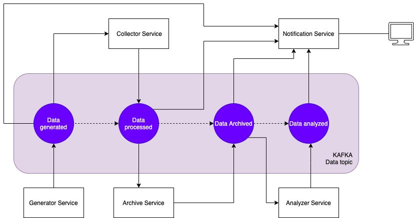

# Microservices project for PV217

Microservices prove of concept project for course PV217.  It provides functionality for collecting, analyzing and persisting IOT data, using event streams (kafka) 

## Logical architecture



## Generator service
  - periodically generates measurements related to power transmission devices
  - push generated data to kafka
  - Features:
    * implements async messaging since using kafka
  - expected output example:
  ```json
  {
	"controlCenterId": "CC-BORDER-CZ/SK",
	"measurements": [
		{
			"name": "freq",
			"timestamp": 1608385521010,
			"value": 42.15563
		},
		{
			"name": "MW",
			"timestamp": 1608385521010,
			"value": -8.813544
		},
		{
			"name": "MVAR",
			"timestamp": 1608385521010,
			"value": -8.813544
		},
		{
			"name": "TemperFahr",
			"timestamp": 1608385521010,
			"value": 66.118645
		}
	]
}
  ```

## Collector service
  - subscribed to kafka, listening for data from generator
  - do some processing (remove unneeded properties, converts some measurements to other units, etc...)
  - push data to kafka
  - Features:
    * implements feature of horizontal scaling since multiple instances help better performance
    * implements async messaging since using kafka
  - expected output example:
  ```json
  {
	"controlCenterId": "CC-BORDER-CZ/SK",
	"measurements": [
		{
			"name": "Frequency",
			"measuredAt": "2020-12-22T08:40:01.005Z",
			"collectedAt": "2020-12-22T08:40:02.500Z",
			"value": 67.193
		},
		{
			"name": "Active Power",
			"measuredAt": "2020-12-22T08:40:01.010Z",
			"collectedAt": "2020-12-22T08:40:02.505Z",
			"value": 123.71
		},
		{
			"name": "Temperature",
			"measuredAt": "2020-12-22T08:40:01.015Z",
			"collectedAt": "2020-12-22T08:40:02.510Z",
			"value": 24.362
		}
	]
  }
  ```

## Archiver service
  - subscribed to kafka, listening for collected data
  - uses DB to persist collected data
  - provides REST API for retrieving specified data in specified time frames
  - Features: 
    * implements feature simulating db unavailability (throwing error at random)
    * implements async messaging since using kafka

## Analyzer service
  - provides REST API for retrieving statistical data about measurements per time frame and different intervals (for example, avg values per hours, during last day, etc...)
  - uses Archiver REST API to retrieve needed data
  - Features:
    * implements feature of "self-healing" by retrying data retrieving from archiver
  - expected request example:
  - expected output example (for request ***{baseurl}/statistics?name=Active%20Power&unit=MINUTES***)
  ```json
  [
	{
		"intervalEnd": "2021-01-08T10:15:00Z",
		"intervalStart": "2021-01-08T10:14:00Z",
		"name": "Active Power",
		"value": 252.45240833333336
	},
	{
		"intervalEnd": "2021-01-08T10:19:00Z",
		"intervalStart": "2021-01-08T10:18:00Z",
		"name": "Active Power",
		"value": 253.09900000000003
	},
	{
		"intervalEnd": "2021-01-08T10:23:00Z",
		"intervalStart": "2021-01-08T10:22:00Z",
		"name": "Active Power",
		"value": 252.29516666666667
	},
	{
		"intervalEnd": "2021-01-08T10:14:00Z",
		"intervalStart": "2021-01-08T10:13:00Z",
		"name": "Active Power",
		"value": 241.94194117647059
	},
	{
		"intervalEnd": "2021-01-08T10:18:00Z",
		"intervalStart": "2021-01-08T10:17:00Z",
		"name": "Active Power",
		"value": 254.012575
	}
  ]
  ```

## Notification service
  - used as kind of logging system
  - subscribed to all kafka topics and stores activity history